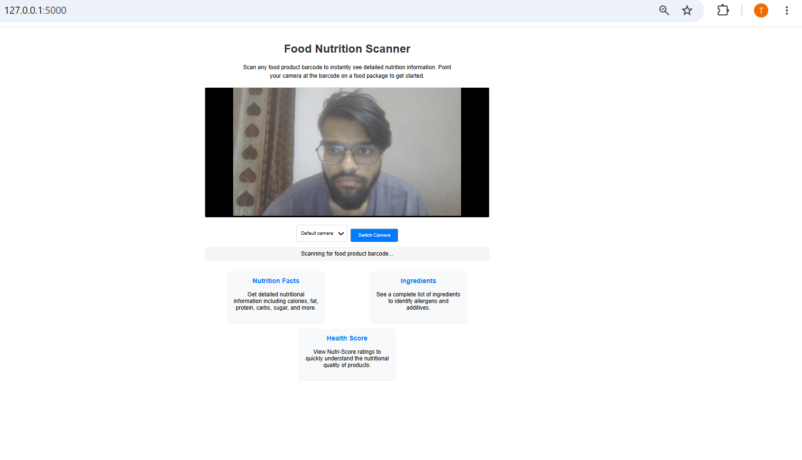

# 🥗 NutriScore Barcode Scanner

A web-based nutrition scanning application that uses a device camera to detect food-product barcodes and retrieve nutritional information and Nutri-Score data.

The project provides a simple interface where users can scan a packaged food product and retrieve available product and nutrition information.

---

## 📌 Project Overview

NutriScore Barcode Scanner connects camera-based barcode detection with food-product data APIs.

The application captures frames from the user's camera, sends them to a Python Flask backend, attempts to detect the barcode, and then uses the detected product barcode to retrieve product information.

### Basic workflow

Camera
↓
Barcode Detection
↓
Barcode Number
↓
Food Product API
↓
Product Information
↓
Nutrition / Nutri-Score
↓
Result displayed to the user

---

## ✨ Features

- 📷 Camera-based barcode scanning
- 🔎 Barcode detection using Python
- 🥗 Food product lookup
- 📊 Nutritional information retrieval
- 🏷️ Nutri-Score information
- 🔄 Product information retrieved through an external API
- 🌐 Flask-based web application
- 💻 Separate local and production project configurations

---
## 🏗️ Architecture / How It Works

The application follows a simple client-server architecture:

1. **Camera Input** – The browser accesses the device camera.
2. **Frame Capture** – Camera frames are captured continuously.
3. **Barcode Detection** – Captured frames are sent to the Flask backend for barcode detection.
4. **Barcode Extraction** – When a barcode is detected, its numeric value is extracted.
5. **Product Lookup** – The barcode is used to retrieve product information from the food-product API.
6. **Nutrition Data** – Available nutritional information and Nutri-Score data are extracted from the API response.
7. **Result Display** – The product and nutrition information is returned to the web interface.

### Architecture Flow

```text
Browser Camera
      ↓
Camera Frames
      ↓
Flask Backend
      ↓
Barcode Detection
      ↓
Barcode Number
      ↓
Food Product API
      ↓
Product / Nutrition Data
      ↓
Web Interface
---

## 🛠️ Tech Stack

### Frontend
- HTML
- CSS
- JavaScript
- Browser Camera API

### Backend
- Python
- Flask
- OpenCV

### API
- Open Food Facts API

### Development
- Git
- GitHub
- Local Flask development server
---

## 🔎 Barcode Detection

The application uses the device camera to capture frames and sends the captured image data to the Flask backend.

The backend processes the image and attempts to detect a food-product barcode. When a barcode is successfully detected, the barcode number is extracted and used for product lookup.

### Detection Flow

```text
Camera
  ↓
Captured Frame
  ↓
Barcode Detection
  ↓
Barcode Number
  ↓
Product Lookup
## 📸 Screenshots

### Scanner Interface



